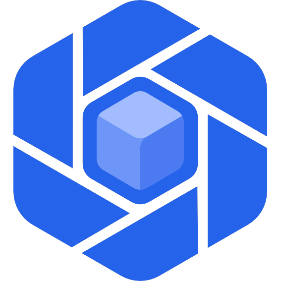

<!--
  SPDX-FileCopyrightText: 2026 Kubuno contributors
  SPDX-License-Identifier: AGPL-3.0-or-later
-->

<div align="center">



# Kubuno — Desktop

[](../LICENSE)


**Desktop clients and the offline-first file synchronisation engine of [Kubuno](https://github.com/kubuno/core) — the self-hosted, libre (AGPLv3) cloud platform, a sovereign alternative to Google Workspace and Microsoft 365.**

A cross-platform sync daemon, and native desktop applications that draw every pixel
themselves — no web view, no bundler, no Node.

</div>

---

## What's inside

Kubuno Desktop is the `desktop/` folder of the [core repository](https://github.com/kubuno/core) (the former
`kubuno/desktop` repository, merged with its history on 2026-10-06). It is **one Cargo workspace for every
operating system**, organised by platform: `common/` carries the complete app, an OS folder only what that system
does differently.

```
desktop/
├── common/     complete and portable (Windows, Linux, macOS)
│   ├── kubuno-desktop-shell-common/   the shell's app: start-up (app::run(platform, ui)), accounts and token
│   │                                  broker, the sync engine's door and its offline sample, the activity log,
│   │                                  the platform extension points (platform) with portable defaults
│   ├── kubuno-desktop-sync/           file synchronisation engine and the kubuno-sync daemon
│   ├── kubuno-desktop-account, -secrets, -api-client, -sync-engine, -app-storage/  accounts, tokens, local data
│   ├── kubuno-desktop-views-syntax, -views-model, -views-meta, -views-macros, -data-model, -data-macros,
│   │   -resources-model, -resources-macros, -resources-tool, kubuno-web-views-compiler-core,
│   │   kubuno-drive-desktop-shared   the portable layers of the framework
│   └── assets/                        Kubuno and application logos
├── windows/    what Windows does differently
│   ├── kubuno-desktop, -ui, -controls, -views, -views-ls, -data, -data-tool, -print, -resources,
│   │   -app-storage-components, kubuno-drive-desktop-app-controls   the Win32 / Direct2D framework
│   ├── kubuno-desktop-shell-controls, -header-data   the header menus and their data, for every app
│   ├── kubuno-desktop-shell/      kubuno-desktop.exe: the Windows interface of the shell's app (views, tray,
│   │                              Explorer integration) and the Windows implementations of its extension points
│   └── packaging/                 Microsoft Store (MSIX)
├── linux/      kubuno-desktop-shell-linux: the entry point (portable platform, text interface)
└── macos/      kubuno-desktop-shell-macos: the entry point (portable platform, text interface)
```

### Platform extension points

Each entry point builds its `Platform` and its user interface and calls
`kubuno_desktop_shell_common::app::run(platform, ui)`. The extension points (`kubuno_desktop_shell_common::platform`)
have portable defaults, so the app runs anywhere with nothing registered:

| Extension point | Portable default | Windows override |
|---|---|---|
| `Folders` | `Documents` in the home directory | the Documents known folder |
| `SystemIntegration` | nothing registered with the system | the `Run` key of a start at logon |
| `UiHost` | a text summary of the sync folders (`TextUi`) | the Win32 window, splash screen and tray |

The Win32 framework only builds on Windows (it is the Windows implementation of the desktop UI); a Linux or macOS
window will join as another `UiHost`.

The module apps live in their module's repository, next to the server and the web frontend (per-module
reorganisation, 2026-10): **Kubuno Chat** (`kubuno-chat.exe`) in
[`kubuno/chat`](https://github.com/kubuno/chat) under `desktop/`, **Kubuno Drive** (`drive.exe`) in
[`kubuno/drive`](https://github.com/kubuno/drive) under `desktop/`. They link this framework
**statically**, through a git tag of the core repository (below), and depend on Kubuno Desktop only as a service
(the account/token broker on the named pipe).

### Versions and tags

Every crate of the workspace shares the version `0.1.2-alpha` (`[workspace.package]` of `desktop/Cargo.toml`),
except the two crates ported from Files (`kubuno-drive-desktop-app-controls`, `kubuno-drive-desktop-shared`, MIT,
`0.1.0`) and the separately released `kubuno-web-views-compiler-core`. **One annotated tag of the core repository
pins them all: `desktop-v<version>`** (`desktop-v0.1.2-alpha`; `desktop-v0.1.1-alpha` was the first one cut in the core repository), following
the shared-crate convention `<crate>-v<version>` with the facade crate `kubuno-desktop`. An app takes every crate it
needs from the same tag; Cargo finds each crate by its name anywhere in the repository:

```toml
[workspace.dependencies]
kubuno-desktop         = { git = "https://github.com/kubuno/core", tag = "desktop-v0.1.2-alpha" }
kubuno-desktop-account = { git = "https://github.com/kubuno/core", tag = "desktop-v0.1.2-alpha" }
```

The web views compiler has its own tags, `web-views-compiler-core-v<its version>` (`web-views-compiler-core-v0.2.1`),
which the core's `@kubuno/views-compiler` WebAssembly shim builds from. The tags made in the former
`kubuno/desktop` repository (`desktop-v0.1.0-alpha`, `web-views-compiler-core-v0.2.0`) keep resolving there. A new
tag is published on GitHub (from GitLab's `sync-github` job) before any app bumps to it.

Names follow one rule (2026-10-03): a crate is `kubuno-<product>-<component>` and its Visual Studio project
`Kubuno.<Product>.<Component>` (`kubuno-desktop-ui` and `Kubuno.Desktop.UI`, `kubuno-drive-desktop` and
`Kubuno.Drive.Desktop`). The framework's facade is `kubuno-desktop` (`use kubuno_desktop::prelude::*`). The
programs keep their names (`kubuno-desktop.exe`, `kubuno-chat.exe`, `kubuno-documents.exe`, `drive.exe`,
`kubuno-sync`). The core's `Kubuno.Core.slnx` shows the workspace under Desktop (Common, Windows, Linux, macOS).

## Features

### Sync engine — `common/kubuno-desktop-sync`

A file synchronisation engine usable **as a library and as a CLI daemon**, on Linux,
Windows and macOS:

- **Bidirectional** — every sync runs **push then pull**. Local creates, edits and
  deletions are detected by comparing on-disk content hashes with the stored etags.
- **Offline outbox** — local operations are recorded in a persistent outbox and
  replayed when the server is reachable again.
- **Safe conflicts** — an edit is sent with `If-Match: <etag>`; if the server changed
  meanwhile, the local copy is renamed `… (conflit <host> <ts>)` (never overwritten),
  the server version is restored, then the conflict copy is uploaded as a new file.
- **Resumable pull** — server changes come from a monotonic cursor, files are fetched
  only when their etag changed, deletions propagate through tombstones, and the cursor
  is saved after every page.
- **Real time** — the `watch` mode combines a filesystem watcher, a WebSocket
  change trigger and a polling fallback.
- **Several instances** — each account has its own server, credentials, folder and
  local state; a folder can be moved without losing it.

```
kubuno-sync
├── api      auth (native refresh-token flow) + delta + download + content/upload/trash
├── store    local SQLite: cursor, folder tree (id→path), file index (id, etag), outbox
├── push     detect local changes → outbox → drain to server (If-Match conflicts)
├── engine   pull delta → apply (folders → files → tombstones) into the sync folder
├── ws       WebSocket listener → real-time remote-change trigger
└── daemon   `watch`: FS watcher + WebSocket + poll fallback → auto push + pull
```

### Windows desktop — `windows/`

Native **Win32 + Direct2D / DirectWrite / DirectComposition** applications sharing one
design system (`kubuno-desktop-ui`), so they share one palette, one set of shape tokens, one
icon set and one set of controls:

- **Kubuno Desktop** (`kubuno-desktop.exe`) — opens on an **application launcher** with
  one tile per app of the connected server, drawn with each module's own logo; a tile
  opens its app in the browser. Pages for **accounts** (several instances side by side),
  **activity** (what the sync loop has been doing) and **settings** (theme, sync
  interval, notifications, start with Windows, forced offline mode, outbound proxy).
  It embeds the sync engine and runs it in the background, with a system-tray menu
  (*Sync now / Open folder / Show / Quit*).
- **Explorer integration, without admin rights** — a Cloud Files API sync root with
  native status overlays (in sync, syncing) and a *Status* column, a navigation-pane
  entry per instance, and on-demand files downloaded on first access.
- **Kubuno Drive** (`drive.exe`, now in [`kubuno/drive`](https://github.com/kubuno/drive), `desktop/windows/`) — a native Windows file manager with tabs, views and
  settings, sharing the Kubuno component library with the other apps. It is a Rust port of the MIT-licensed
  *Files* project; credits and architecture notes are in
  the drive repository's `desktop/windows/README.md`.
- **Kubuno Chat** (now in [`kubuno/chat`](https://github.com/kubuno/chat), `desktop/windows/`) and **Kubuno Documents** (now in
  [`kubuno/office`](https://github.com/kubuno/office), `desktop/`, with its engine in `common/core`) — native two-pane
  messaging, and a native word processor for the Office module.

### Single instance

Some windows make no sense twice. Three rules, one primitive (`common/kubuno-desktop-single-instance`):

| What | Key | A second launch / open |
|---|---|---|
| **Kubuno Desktop** | the user and the session only (SID + session id; uid + `XDG_SESSION_ID`): not the profile, the data directory or the executable's path | hands its command line to the running shell and exits with code 0 before any splash screen; the shell comes back from the tray or the taskbar to the front, on the `--page` asked for. `--background` (the start at logon) changes nothing |
| **An Office document** (Documents, Spreadsheets, Diagrams, Presentations, Projects) | the app, the profile and the document: a server document (server URL + id) or a local file (path normalised: absolute, resolved, no `\\?\`, one separator, case-folded on Windows and macOS) | the window already showing that document comes to the front; another document still opens its own window, like Word. A new blank document is never single |
| **A secondary window** (Settings, About, a confirmation…) | a string per UI thread: `kubuno_desktop::singleton::show(key, make)` / `show_in_window(key, owner, make, on_closed)` | the open one is focused instead of a copy |

**Developer instances.** A second Kubuno Desktop only runs as an explicit developer instance, compiled in debug builds
only (or with the shell's `dev-instance` feature, which release packaging never enables): `--dev-instance <name>` or
`KUBUNO_DEV_INSTANCE=<name>`. A debugging session's offline sample (F5) is one too. A sandboxed profile
(`KUBUNO_SANDBOX_DIR`) alone is **not**: an agent running a sandboxed shell next to the user's passes
`--dev-instance <agent>` as well.

**How.** `acquire(key, activation, wait)` takes an OS lock or hands the activation (arguments + working directory, one
JSON line) to its holder:

| | Windows | Linux | macOS |
|---|---|---|---|
| lock | named mutex `Local\kubuno-<app>-<digest>`, DACL current user only; *abandoned* when its owner dies | `flock` on `<runtime>/kubuno-<app>-<digest>.lock` | as Linux |
| hand-off | named pipe `\\.\pipe\kubuno-<app>-<digest>`, DACL current user only, remote clients rejected, `SECURITY_IDENTIFICATION` | Unix socket `.sock` next to the lock, `0600`, peer uid checked (`SO_PEERCRED`) | as Linux (`getpeereid`) |
| runtime dir | — | `$XDG_RUNTIME_DIR/kubuno`, else `/tmp/kubuno-<uid>` (`0700`, owner checked) | `$TMPDIR/kubuno-<uid>` |
| focus | the second launch passes its foreground right (`AllowSetForegroundWindow`); the window restores, comes forward, or flashes when the system refuses | the window system | LaunchServices also reopens a running bundle |

A crashed instance never blocks the next launch: the OS releases the lock with the process and the next instance
recreates the endpoint (a leftover socket file is removed under the lock). A running instance that does not answer
within 5 s: the shell does not start a second one (exit code 1, logged); an Office app opens the document anyway (the
server's digest guard still protects its saves). Every hand-off is logged on both sides
(`%LOCALAPPDATA%\Kubuno\logs`).

## Usage (sync daemon)

```bash
cd desktop && cargo build --release -p kubuno-desktop-sync

# Connect and choose the local sync folder
./target/release/kubuno-sync login \
  --server https://cloud.example.com \
  --login you@example.com \
  --password '••••••••' \
  --folder ~/Kubuno

./target/release/kubuno-sync sync                 # once: push local edits, then pull
./target/release/kubuno-sync watch --interval 30  # continuously
./target/release/kubuno-sync status               # server, folder, cursor
./target/release/kubuno-sync move --id <instance> --to <new-folder>   # relocate a folder
```

Configuration and state live under the OS configuration directory
(`~/.config/kubuno-desktop` on Linux, `~/Library/Application Support` on macOS,
`%APPDATA%` on Windows). The daemon signs in as a desktop client and keeps a rotating
refresh token (file mode `0600`).

## Build & packaging

`kubuno-sync` is pure Rust: TLS uses **rustls** and SQLite is **vendored**, so there is
no system OpenSSL or SQLite dependency and builds are identical across platforms.

| Artifact | Platform | Produced by |
|---|---|---|
| `kubuno-sync` `.deb`, `.rpm` | Linux | `common/build_deb.sh` (`cargo deb` / `cargo generate-rpm`) |
| `kubuno-sync` `.exe` (zip) | Windows | `cargo build` + zip |
| `kubuno-sync` binaries (zip) | macOS (Apple Silicon and Intel) | `cargo build` per target |
| `kubuno-desktop` `.exe` / MSIX | Windows 10/11 | `windows/kubuno-desktop-shell` + `windows/packaging/package-msix.ps1` |

On a `desktop-v*` tag, CI builds every target on its **native runner** and attaches the
artifacts to a GitHub Release (the core repository's `.github/workflows/desktop-release.yml`; `desktop.yml`
checks every change of `desktop/`).

Windows shell, from `desktop/`:

```bash
cargo build --release -p kubuno-desktop-shell     # → target/release/kubuno-desktop.exe
cargo run   -p kubuno-desktop-ui --example gallery  # the component gallery (UI reference)
```

Every exe links the UI framework (`kubuno-desktop-ui`) and Rust's `std` statically: it runs
on its own, with no DLL beside it. Kubuno Desktop is a service dependency of the
other apps (account broker, sync, launcher), never a binary one.

The full guide — per-machine build directory, memory-constrained builds, Microsoft
Store submission — is in **[`BUILD.md`](BUILD.md)**.

## Roadmap

- Native windows for Linux and macOS (today their entry points run the portable app with a text interface).
- New local folders created on the server (today only files in known folders are pushed).
- Server-side idempotency for drive writes, so a retried create cannot duplicate.
- Code signing for the MSIX package.
- OS keyring for the refresh token.

## Security

Please report vulnerabilities privately — see [`SECURITY.md`](../SECURITY.md).

## Contributing

Issues and pull requests are welcome. For any significant change, please open an issue first.

## License

[AGPL-3.0-or-later](../LICENSE) © Kubuno contributors. The crates `kubuno-drive-desktop-app-controls`
(`windows/`) and `kubuno-drive-desktop-shared` (`common/`, see their `LICENSE-MIT`) are
MIT-licensed, like the project they are ported from.
